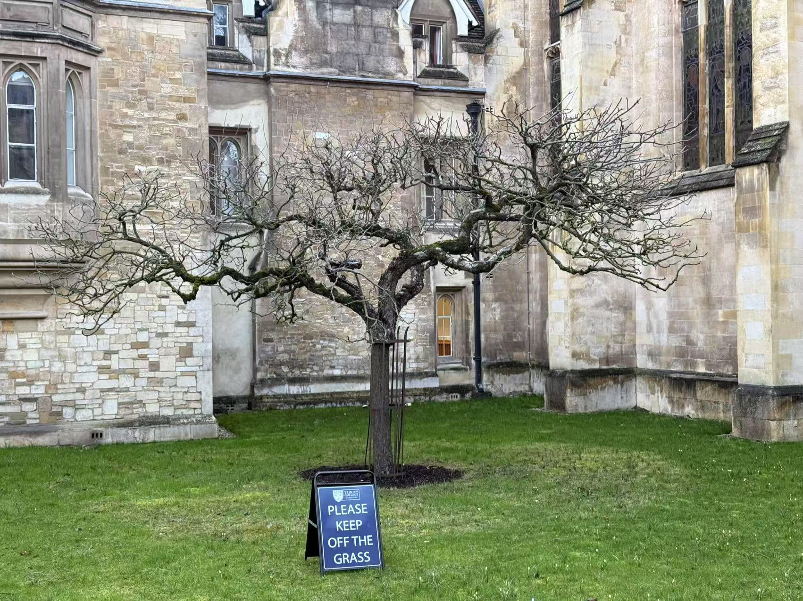

## Visit to University of Cambridge

### Study

I went to the University of Cambridge for two week-long visits on January 8 2025. I attended some business courses in Homerton College. The courses covered various topics, including leadership, innovation, and entrepreneurship. I had the opportunity to learn various frameworks of business management and to engage with fellow participants from diverse backgrounds.

### View

I had the opportunity to explore the beautiful campus of the University of Cambridge. Especially the stunning architecture and the serene atmosphere left a lasting impression on me.

Also, I had taken a picture of an apple tree which was reckoned to be the original apple tree that inspired Sir Isaac Newton's theory of gravity.

