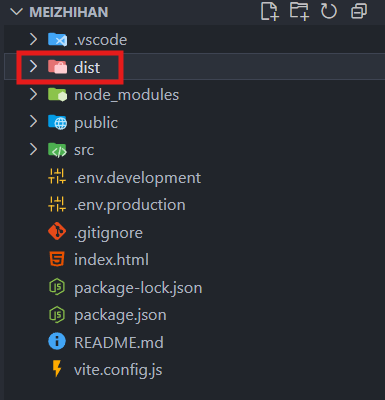

## Deploying a Vue Project

As I just graduated from the university, I began to develop my own website shareing my profile and some ideas and decided to name it "MEIZHIHAN" which is my full name. In this project, I chose the Vue.js as the frontend framework, because it is progressive, flexible, and easy to integrate with other projects and libraries.

When I finished the first version of my website in my local computer, I needed to deploy it to a web server. So, I bought a cloud server from Alibaba Cloud and began my deployment.

### 1. Build the Project

When you finish your Vue project, you need to create a production build. You can do this by running the following command in your project directory:

```bash
npm run build
```

This command will generate a `dist` folder containing the production-ready files for your website.



---

### 2. Upload to the Server

After building the project, you need to upload the `dist` folder to your web server.

I used a terminal tool called `Termius` to upload the folder. `Termius` allows you to easily manage SSH connections and provide the SFTP to transfer files between your local machine and the server.

And I put the `dist` folder in the path `/var/www/meizhihan/` on the server.

---

### 3. Install the Nginx

I chose the Nginx as my web server because it is lightweight, high-performance, and easy to configure. To install Nginx on your server, you can use the following command:

```bash
sudo apt update
sudo apt install nginx
```

or 

```bash
sudo yum update -y
sudo yum install nginx
```

After the installation is complete, you can start the Nginx service:

```bash
sudo systemctl start nginx
```

And enable it to start on boot:

```bash
sudo systemctl enable nginx
```

Check the status of Nginx:

```bash
sudo systemctl status nginx
```

If Nginx is available, you will see `active (running)` in the output

---

### 4. Configure Nginx (HTTP)

Open the Nginx configuration file:

```bash
sudo vim /etc/nginx/nginx.conf
```

Press `i` to enter insert mode.

Insert the content below into the `http {}` block in `nginx.conf`:

```nginx
server {
    listen 80;
    server_name your_domain.com;
    # If you do not have a domain, you can use your server's IP address
    # server_name your_server_ip;

    location / {
        root /your/path/to/dist/;
        # For me, it is /var/www/meizhihan/dist/
        index index.html;
        try_files $uri $uri/ /index.html;
    }
}
```

After making the changes, press `Esc` to exit insert mode and press `:wq` to save and quit.

Check the configuration for syntax errors:

```bash
sudo nginx -t
```

Restart Nginx to apply the changes:

```bash
sudo systemctl restart nginx
```

Now you can access your website by navigating to `http://your_domain.com` in your web browser. (Make sure you have bought a domain and pointed it to your server's IP address, or you can access it via the server's IP address.)

---

### 4. Configure Nginx (HTTPS) [OPTIONAL]

To be released